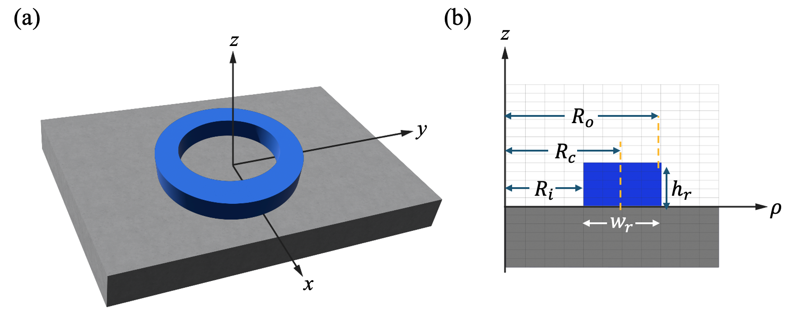
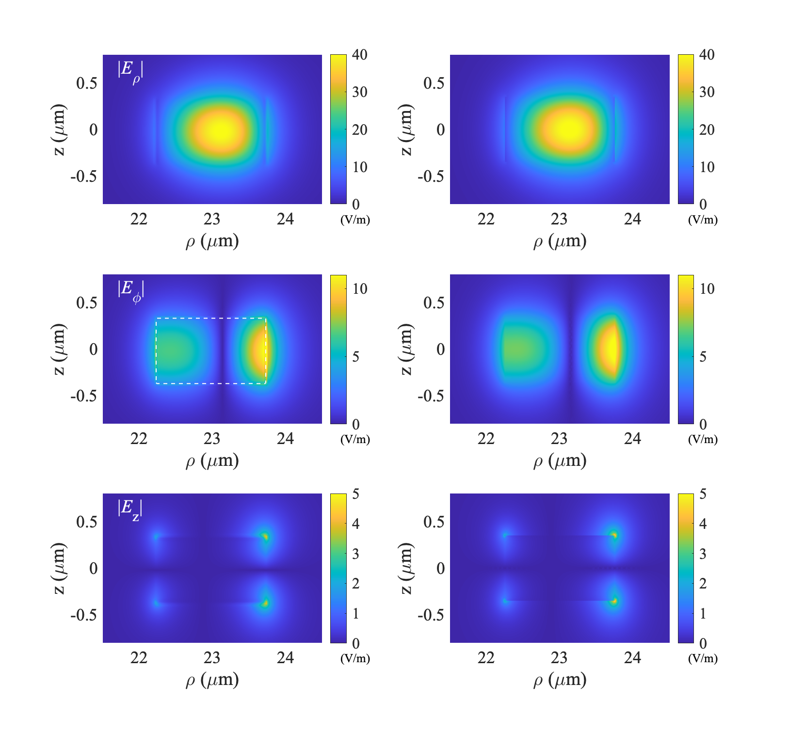

# DieRingSolver
A finite-differences-based MATLAB solver to study wave propagation in dielectric rings.

You can find the full formulation and examples in our paper: https://www.nature.com/articles/s41598-025-18869-z

If you use this code, please cite: 
Simsek, E., Niang, A., Islam, R. et al. A mixed-field formulation for modeling dielectric ring resonators and its application in optical frequency comb generation. Sci Rep 15, 35098 (2025). https://doi.org/10.1038/s41598-025-18869-z

